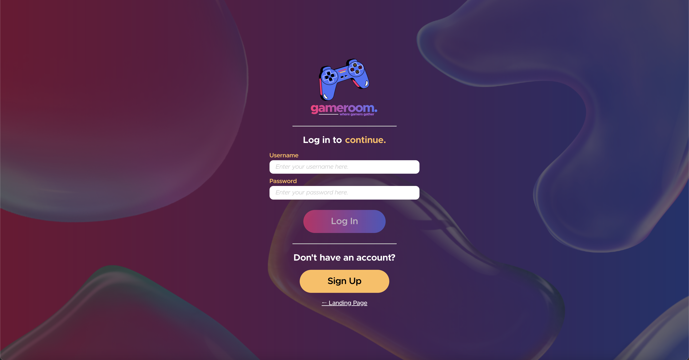
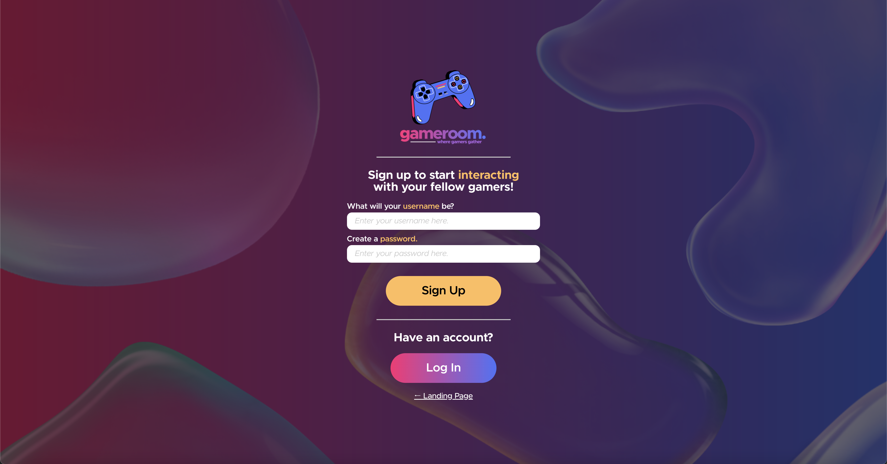
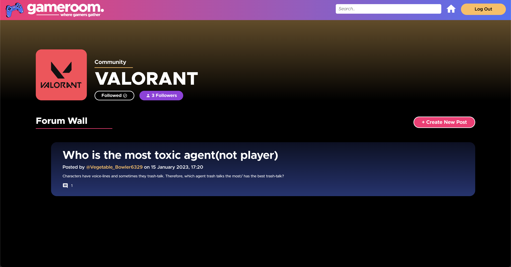
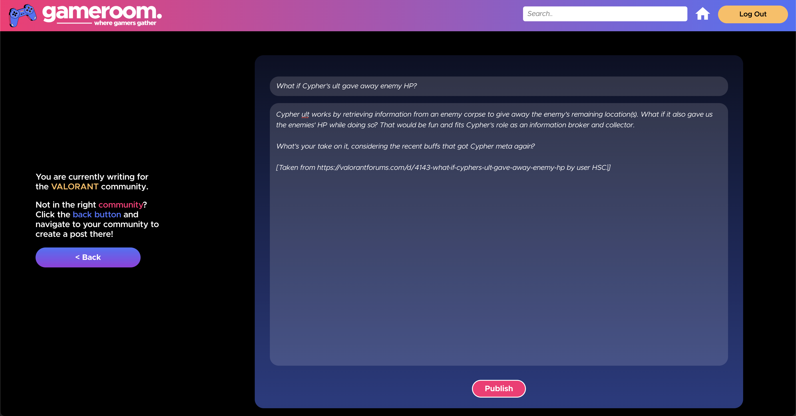
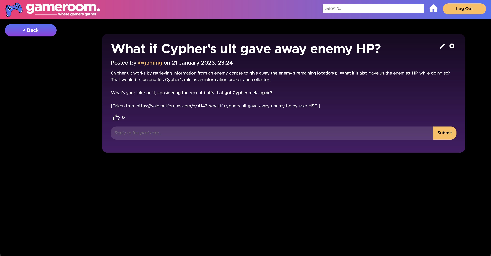
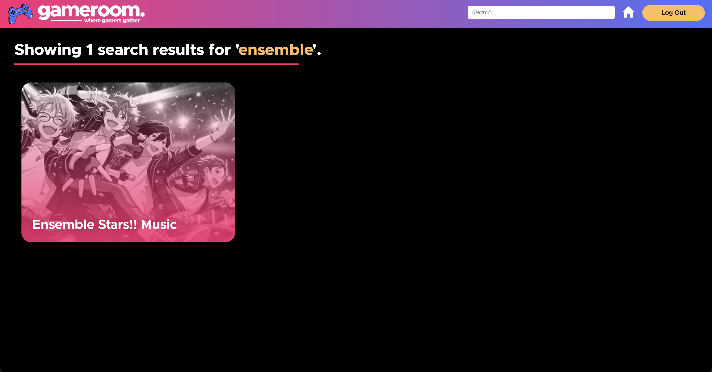

    

# GameRoom (stylized as gameroom, in all lower cases)

<h4>Please view this project on a desktop, with full window tab size, as the application is not designed to be responsive (yet).</h4>

GameRoom is a forum for gamers to interact with each other. Due to the creator's love for playing games, she decided to center her project around this interest.

This project is heavily inspired by <u>Reddit</u>, as well as <u>Spotify</u> (for the frontend). The two have heavily influenced the entire design of this project.

**Warning: This project is heavily limited and is only currently restricted to having communities for a few games. Due to the creator's limited knowledge, there are a lot of things which are still unoptimized.**

# Table of Contents

* [Purpose](#purpose)
* [Features](#features)
* [User Guide](#user-guide)
* [Queries, Feedback, Improvements](#queries-feedback-improvements)

# Purpose

This project is built for Computing for Voluntary Welfare Organization's (CVWO) assignment, with a TypeScript React frontend and a Ruby on Rails backend.

# Features

As a CRUD app, users are able to:

* Create a new post
* Read other users' posts
* Update their posts (edit)
* Delete their posts

These basic CRUD features also work for comments, which can be made for each post.

Additional features are as follows:
* Authentication system
* Categorizing posts into communities
* Search function (which is still faulty, but is still functioning)

Future iterations:
* Allowing users to make their own communities
* Having an account page where users can customize their profiles
* Implement Rich Text Editor or MarkDown features for the posts
* Designing a responsive website

# User Guide

### Landing Page, Log In and Sign Up Pages

When accessing https://gameroom-forum.netlify.app for the first time, you will be directed to the landing page where you can access the Log In or Sign Up pages.

The account restrictions are as follows:

* Its username must be **3 to 30 characters** long and **cannot start or end with _ or .**
* Its password must be **at least 6 characters** long.

**Warning: The log-in or sign-up process might take too long at times. Please refresh if it does not load after a few minutes.**

### Dashboard

The dashboard is where you can access your followings. If you follow one or multiple communities, you are able to view them here. 

You can use the search bar on top to search for communities (press **Enter** on your keyboard to enter your query). The home button is for you to redirect back to the dashboard from any page. Alternatively, clicking on the logo on the top left does the same thing.

### Community Page

On this page, you can:

* Create a new post by clicking on the `+ Create New Post` button.
* View a post by pressing on the posts (the black-blue gradient container).
* Follow a community.

### Create Post Page

Create a post by typing in a title and a post body, and click `Publish`.

### Community Post Page

In this page, you can enter a comment by typing a reply on the input field and clicking `Submit`.

When clicking on the posts on the [Community Page](#community-page), you will be able to read others' posts and also comment on it.

To delete posts, simply press the bin on the top right corner and click `Yes, I want to delete this` in the confirmation modal. To edit posts, click the pencil icon and text fields should show in place of the title and post body. Simply edit them and click `Save changes` to save your changes, or the pencil icon to cancel any changes.

### Search Page

Utilizing the search bar on top to search for your query and pressing `Enter` on your keyboard will yield this kind of results. However, the search function is currently not always accurate, so it might show inaccurate results from time to time.

# Queries, Feedback, Improvements

For any queries or feedback, please leave them [here](https://forms.gle/mjNugkyK7dbxoebz5)! It is an anonymous form.

    <b><i>Built by <a href="https://github.com/melissaharijanto">@melissaharijanto</a> on GitHub</i></b>.

